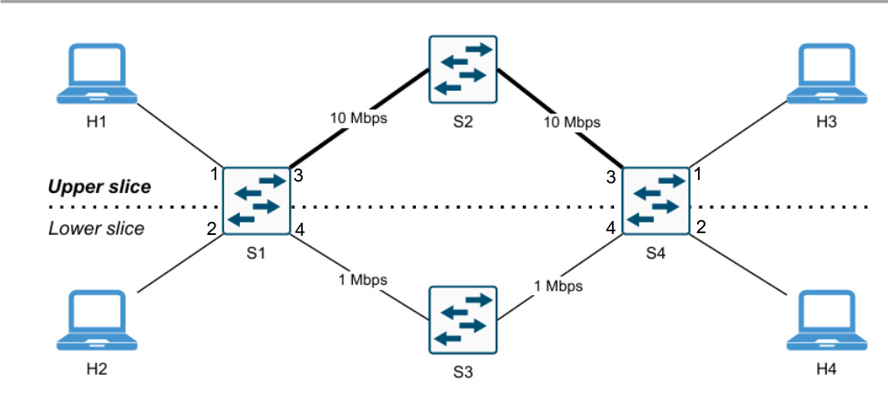

# Network Slicing in SDN con Mininet e Ryu

Project work per l'esame di **Network and Cloud Infrastructures**

Implementazione di **topology slicing** e **service slicing** in ambiente SDN,
con topologia emulata in Mininet e controller Ryu su OpenFlow 1.3. Il controller
misura il carico dei due percorsi e lo espone a una dashboard, e in modalità
service può riassegnare dinamicamente la capacità inutilizzata dello slice
premium.

## Contenuto del repository

```
.
├── topology.py              # topologia Mininet: 4 switch, 4 host, 2 percorsi
├── slicing_controller.py    # controller Ryu, due modalità e politica dinamica
├── dashboard.html           # visualizzazione del carico dei link core
├── README.md
└── docs/
    ├── elaborato.pdf        # documento d'esame
    ├── topologia.png
    └── screenshots/         # output di tutti gli esperimenti
```

Il controller scrive le proprie misure in `stats.json`, che la dashboard rilegge
ogni secondo. È un file generato: va in `.gitignore` insieme a `stats.json.tmp`.

## La topologia



Due percorsi paralleli fra gli switch di accesso `s1` e `s4`: quello superiore
via `s2` a 10 Mbps e 2 ms, quello inferiore via `s3` a 1 Mbps e 5 ms.

| Host | IP | MAC | Switch di accesso |
|---|---|---|---|
| h1 | 10.0.0.1 | `00:00:00:00:00:01` | s1, porta 1 |
| h2 | 10.0.0.2 | `00:00:00:00:00:02` | s1, porta 2 |
| h3 | 10.0.0.3 | `00:00:00:00:00:03` | s4, porta 1 |
| h4 | 10.0.0.4 | `00:00:00:00:00:04` | s4, porta 2 |

Sugli switch di accesso **la porta 3 è lo slice upper, la porta 4 il lower**.

## Requisiti

**Ubuntu 22.04 LTS (Python 3.10)**, Mininet 2.3.0 con Open vSwitch, Ryu 4.34.

> Non usare Ubuntu 24.04: Python 3.12 ha rimosso `distutils` e Ryu non è
> installabile.

La dashboard carica Chart.js da CDN, quindi la macchina deve avere accesso a
internet. Senza, lo schema dei link continua a funzionare e al posto del grafico
compare un messaggio.

## Installazione

### 1. Pacchetti di sistema

```bash
sudo apt update
sudo apt install -y git python3-pip python3-venv build-essential iperf tcpdump d-itg
```

### 2. Mininet

```bash
git clone https://github.com/mininet/mininet
cd mininet && git checkout -b mininet-2.3.0 2.3.0 && cd ..
sudo PYTHON=python3 mininet/util/install.sh -nv
```

### 3. Ryu in virtualenv

L'ordine dei comandi è vincolante.

```bash
python3 -m venv ~/ryu-venv
source ~/ryu-venv/bin/activate
pip install --upgrade pip
pip install "setuptools==57.5.0" wheel pbr
pip install --no-build-isolation ryu==4.34
pip install "eventlet==0.33.3" "dnspython==2.2.1"
```

Ryu 4.34 importa da eventlet una costante rimossa nelle versioni recenti e senza
questa patch non si avvia:

```bash
sed -i 's/^\( *\)from eventlet\.wsgi import ALREADY_HANDLED/\1ALREADY_HANDLED = None/' \
    ~/ryu-venv/lib/python3.10/site-packages/ryu/app/wsgi.py
```

Verifica finale (atteso `ryu-manager 4.34`):

```bash
ryu-manager --version
```

## Esecuzione

Servono **tre terminali**. Il virtualenv serve solo a Ryu; Mininet gira con
`sudo` e il Python di sistema. Avviare sempre prima Ryu, così gli switch trovano
il controller già in ascolto sulla porta 6653.

**Terminale 1 — controller**

```bash
source ~/ryu-venv/bin/activate

# modalità topology (default): isolamento fra slice
ryu-manager slicing_controller.py

# modalità service: tutti comunicano, percorso scelto per servizio
SLICING_MODE=service ryu-manager slicing_controller.py

# service con riassegnazione dinamica della capacità
DYNAMIC=1 SLICING_MODE=service ryu-manager slicing_controller.py
```

Le prime righe di log confermano la configurazione attiva. `DYNAMIC=1` richiede
la modalità service: in topology viene segnalato e ignorato, perché lì non
esiste la nozione di traffico video.

**Terminale 2 — rete**

```bash
sudo mn -c
sudo python3 topology.py
```

Attendere il prompt `mininet>` prima di digitare. Per chiudere: `exit` nella
CLI, poi `sudo mn -c`.

**Terminale 3 — dashboard**

```bash
python3 -m http.server 8000
```

Poi aprire `http://localhost:8000/dashboard.html`.

> Ryu e `http.server` vanno lanciati **dalla stessa cartella**, la radice del
> repository: il controller scrive `stats.json` nella propria directory di
> lavoro e la dashboard lo cerca accanto a sé.

> La pagina non va aperta con un doppio clic. Come `file://` il browser blocca
> la lettura di `stats.json` e il grafico resta vuoto senza segnalare nulla.

Per cambiare configurazione basta fermare Ryu con Ctrl+C e rilanciarlo: Mininet
non va riavviato, gli switch si riconnettono da soli. `sudo mn -c` non termina
Ryu.

## Riproduzione degli esperimenti

### Modalità topology

```
mininet> pingall                      # atteso: 66% dropped (4/12)
mininet> h1 arp -n                    # 10.0.0.3 risolto, gli altri (incomplete)
mininet> h1 ping -c5 h3               # RTT medio ~12 ms  (slice upper)
mininet> h2 ping -c5 h4               # RTT medio ~24 ms  (slice lower)
```

Throughput sui due slice:

```
mininet> h3 iperf -s -p 5001 &
mininet> h1 iperf -c 10.0.0.3 -p 5001 -t 10 -i 1      # ~9,55 Mbps
mininet> h3 pkill iperf
mininet> h4 iperf -s -p 5001 &
mininet> h2 iperf -c 10.0.0.4 -p 5001 -t 10 -i 1      # ~1,21 Mbps
```

Verifica del percorso fisico, da due terminali aggiuntivi:

```bash
sudo tcpdump -i s2-eth1 -n icmp -c 20     # solo h1 <-> h3
sudo tcpdump -i s3-eth1 -n icmp -c 20     # solo h2 <-> h4
```

```
mininet> h1 ping -c10 h3 &
mininet> h2 ping -c10 h4
```

### Modalità service

Riavviare Ryu con `SLICING_MODE=service`; Mininet non va riavviato.

```
mininet> pingall                      # atteso: 0% dropped (12/12)
```

Stessa coppia di host e stesso bitrate, cambia solo la porta di destinazione:

```
mininet> h3 iperf -s -u -p 9999 &
mininet> h1 iperf -c 10.0.0.3 -u -p 9999 -b 20M -t 10 -i 1   # ~9,72 Mbps
mininet> h3 pkill iperf
mininet> h3 iperf -s -u -p 5001 &
mininet> h1 iperf -c 10.0.0.3 -u -p 5001 -b 20M -t 10 -i 1   # ~0,97 Mbps
```

Il dato rilevante è il **Server Report**, che riporta il rate ricevuto; i valori
del client indicano solo il rate di invio.

Ispezione della flow table durante i due flussi:

```bash
sudo ovs-ofctl dump-flows s1 -O OpenFlow13
```

Le due regole UDP hanno identici `in_port`, `dl_src` e `dl_dst`: cambia solo
`tp_dst` (9999 contro 5001), e con esso priorità (20 contro 10) e porta di
uscita (`s1-eth3` contro `s1-eth4`).

> Le flow entry scadono dopo 30 s di inattività: `dump-flows` va lanciato
> **mentre il flusso scorre**, altrimenti restituisce un elenco vuoto.

### Riassegnazione dinamica

Riavviare Ryu con `DYNAMIC=1 SLICING_MODE=service`. Entro pochi secondi, senza
che sia passato traffico, il log riporta il prestito dello slice upper: non c'è
video, quindi la condizione è verificata.

Effetto del prestito, con lo stesso comando usato in modalità topology:

```
mininet> h4 iperf -s -p 5001 &
mininet> h2 iperf -c 10.0.0.4 -p 5001 -t 10 -i 1      # ~9,54 Mbps, non 1,21
```

La regola di deviazione è visibile in tabella mentre il flusso scorre:

```bash
sudo ovs-ofctl dump-flows s1 -O OpenFlow13 | grep 00:00:00:00:00:02
```

Ha priorità 15, match sulla sola coppia di MAC e nessun `idle_timeout`. La
regola del verso di ritorno ha `in_port=3`, cioè entra dallo slice upper: il
prestito è bidirezionale.

Revoca all'arrivo del traffico video:

```
mininet> h3 iperf -s -u -p 9999 &
mininet> h2 iperf -c 10.0.0.4 -p 5001 -t 40 -i 5 &
# attendere ~15 secondi
mininet> h1 iperf -c 10.0.0.3 -u -p 9999 -b 20M -t 20 -i 5
```

Nel log compare la rimozione delle deviazioni, e nella dashboard il traffico
h2↔h4 passa dal percorso da 10 Mbps a quello da 1.

### Traffico realistico con D-ITG

`iperf` genera flussi a rate costante e non misura il ritardo. D-ITG permette di
specificare separatamente dimensione dei pacchetti e cadenza, ciascuna con una
distribuzione statistica. La convenzione dei parametri è **minuscola per il
pacchetto, maiuscola per la cadenza**.

```
mininet> h3 ITGRecv &

# profilo video: pacchetti grandi a cadenza costante
mininet> h1 ITGSend -a 10.0.0.3 -rp 9999 -T UDP -c 1400 -C 850 -t 20000 -x /tmp/recv_video.log
mininet> h3 ITGDec /tmp/recv_video.log

# profilo dati: pacchetti piccoli e irregolari
mininet> h1 ITGSend -a 10.0.0.3 -rp 5001 -T UDP -u 64 1024 -E 400 -t 20000 -x /tmp/recv_dati.log
mininet> h3 ITGDec /tmp/recv_dati.log

mininet> h3 pkill ITGRecv
```

Risultati attesi, a parità di mittente e destinatario:

| Flusso | Slice | Ritardo medio | Perdita |
|---|---|---|---|
| porta 9999 | upper | ~5,7 ms | 0% |
| porta 5001 | lower | ~455 ms | ~36% |

Il ritardo sul lower non è propagazione, che vale 10 ms in tutto: è tempo di
attesa in coda sul link saturo.

> Il generatore non raggiunge gli 850 pacchetti al secondo richiesti ma si ferma
> attorno a 610, perché con pacchetti da 1400 byte satura la CPU della macchina
> virtuale. Non è una perdita di rete: `ITGDec` riporta 0% di pacchetti persi.

## Documentazione

In `docs/` si trovano l'elaborato d'esame e un registro dei test che riporta
ogni comando eseguito, i valori ottenuti e la spiegazione delle difformità
numeriche riscontrate, come la differenza fra bitrate applicativo e bitrate
misurato sui contatori dello switch.

Gli screenshot di tutti gli esperimenti sono in `docs/screenshots/`, numerati
nell'ordine in cui sono stati prodotti e richiamati dal registro dei test.
